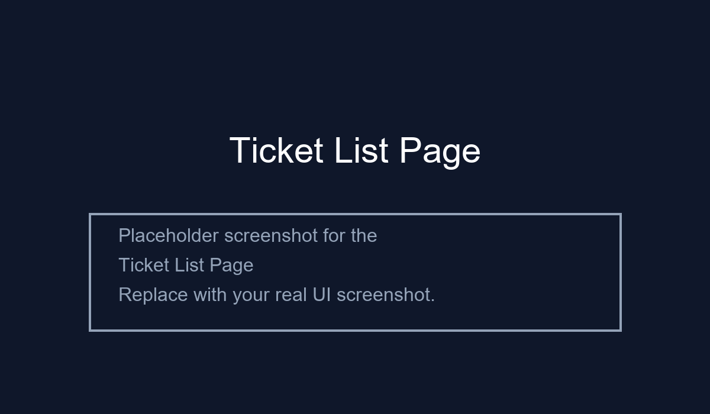
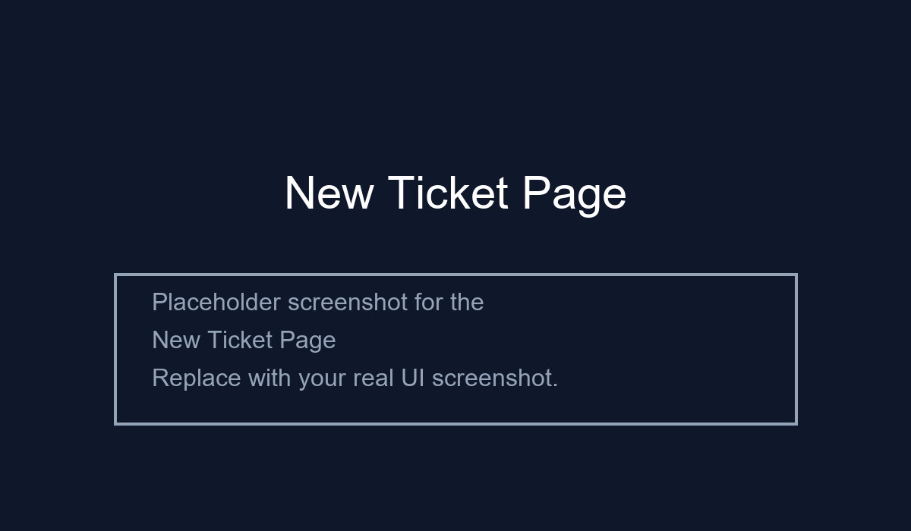
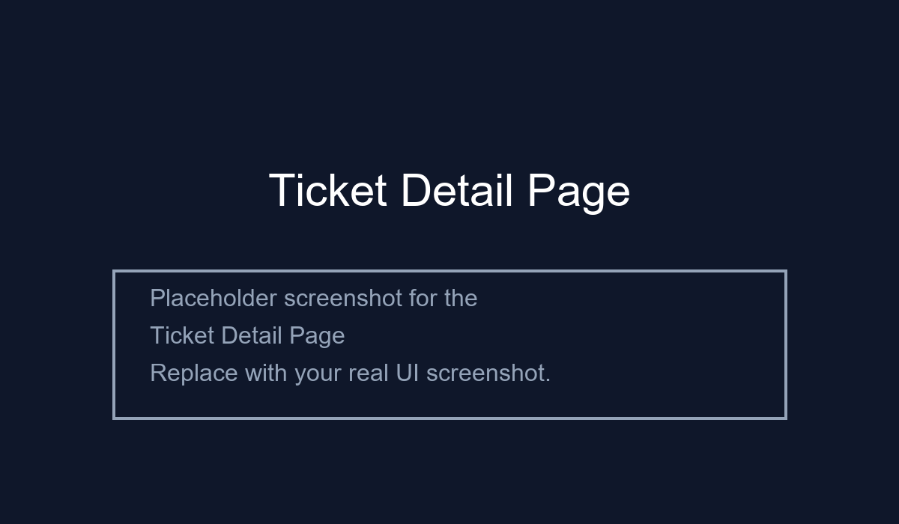

# Support CRM System

A modern, full-stack **Customer Support Ticketing CRM** built for fast issue tracking and easy collaboration.
This project includes:
- **Backend** with FastAPI, SQLModel, and SQLite
- **Frontend** with React, Vite, and Tailwind CSS
- **Simple workflow** for creating, searching, filtering, viewing, and updating support tickets

## Problem Statement

Support teams need a lightweight tool to manage customer requests without heavyweight enterprise systems.
Existing solutions can be slow, overly complex, or missing the key workflow for rapid ticket triage and customer follow-up.

## Solution

This project delivers a clean support ticket CRM that is:
- easy to use for agents,
- fast to deploy,
- simple to extend,
- and built as a full stack example with real API and UI integration.

## What makes this project unique

- **Search-as-you-type experience** with backend-powered filtering across ticket ID, customer name, email, subject, and description.
- **Dashboard-style ticket summary** showing total tickets plus status/priority breakdowns.
- **Light but realistic data model** with tickets and notes, avoiding over-engineering while still supporting real support workflows.
- **Rich ticket detail view**: update status, change priority, and add internal notes all from the same page.
- **Copy ticket ID action** for fast sharing during triage.

## Key UI pages

### 1. Ticket list page

This page is the main support dashboard:
- Search tickets live
- Filter by status and priority
- View ticket summaries and status badges
- Quickly navigate to details or create a new ticket



### 2. New ticket page

A simple form to create a new support request:
- customer name and email
- optional order number
- priority selection
- subject and issue description



### 3. Ticket detail page

Inspect and update a ticket:
- see ticket metadata and timestamps
- change status and priority
- add internal notes
- review existing notes history



> Note: Add screenshot files at `./screenshots/ticket-list.png`, `./screenshots/new-ticket.png`, and `./screenshots/ticket-detail.png` to enable these previews.

## How it works

### Backend flow

1. The frontend calls the API under `backend/app`
2. Tickets are stored in SQLite using SQLModel
3. Ticket IDs are generated sequentially like `TKT-001`
4. Search and filter parameters are passed to `GET /api/tickets`
5. Ticket updates and notes are handled by `PUT /api/tickets/{ticket_id}`

### Frontend flow

1. The app loads the ticket list from the backend
2. Filters and search terms are debounced so the UI stays responsive
3. Clicking a ticket opens the detail page
4. Status, priority, and note changes are saved immediately
5. The app refreshes the ticket detail after every update

## Project structure

- `backend/`
  - `app/main.py` — FastAPI application entry point
  - `app/db.py` — database session and connection logic
  - `app/models.py` — SQLModel ORM models for tickets and notes
  - `app/schemas.py` — request/response schemas
- `frontend/`
  - `src/App.tsx` — application routes and layout
  - `src/pages/` — page components for list, create, and detail
  - `src/lib/api.ts` — API client and types
  - `src/components/` — reusable UI components

## Tech stack

- **Frontend**: React, TypeScript, Vite, Tailwind CSS
- **Backend**: FastAPI, SQLModel, Uvicorn, SQLite
- **Development**: npm/yarn for frontend, pip for backend

## Setup instructions

### Backend

```powershell
cd backend
python -m venv .venv
.\.venv\Scripts\Activate.ps1
pip install -r requirements.txt
```

Start the backend server:

```powershell
cd backend
.\.venv\Scripts\Activate.ps1
uvicorn app.main:app --reload --port 8000
```

### Frontend

```powershell
cd frontend
npm install
npm run dev
```

Open the app at `http://localhost:5173`.

## API endpoints

- `POST /api/tickets` — create a new ticket
- `GET /api/tickets` — list tickets with optional `status`, `priority`, and `search` parameters
- `GET /api/tickets/{ticket_id}` — retrieve a single ticket detail
- `PUT /api/tickets/{ticket_id}` — update ticket status/priority and add notes

## Recommended workflow

1. Start the backend and frontend locally
2. Create a new ticket from the form
3. Use search and filters on the ticket list
4. Open a ticket detail view to update status and add notes
5. Verify that changes persist and the updated ticket is returned

## Notes for improvement

- Add authentication for support agents
- Persist notes with author and visibility metadata
- Add ticket assignment and team routing
- Support file attachments and customer reply tracking

## Screenshots

Add actual screenshots to the `screenshots/` folder and keep the filenames:
- `ticket-list.png`
- `new-ticket.png`
- `ticket-detail.png`

## License

This project is provided for learning and support workflow demonstration.

